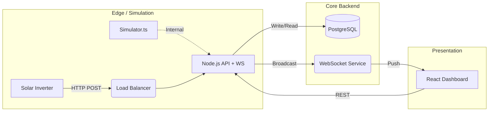

# PowerTrack - Solar Energy Monitoring System

> A comprehensive solar energy monitoring platform designed for educational and government institutions in Indonesia.

## Table of Contents

1.  [Project Identity](#1-project-identity)
2.  [System Components](#2-system-components-overview)
3.  [Architecture](#3-architecture)
4.  [Data Flow](#4-data-flow)
5.  [Operational Model](#5-operational-model)
6.  [Features](#6-features)
7.  [Quick Start](#7-quick-start)
8.  [Developer Runbook](#8-developer-runbook)
9.  [Production Deployment](#9-production-deployment)
10. [Configuration](#10-configuration)
11. [Database Schema](#11-database-schema)
12. [Energy Accounting](#12-energy-accounting-strategy)
13. [Timezone Strategy](#13-timezone-strategy)
14. [Data Retention](#14-data-retention--partitioning)
15. [System Resilience](#15-system-resilience)
16. [Security Model](#16-security-model)
17. [Observability](#17-observability)
18. [Production Checklist](#18-production-hardening-checklist)
19. [API Reference](#19-api-reference)
20. [Testing](#20-testing-strategy)
21. [Known Limitations](#21-known-limitations)
22. [Contributing](#22-contributing)
23. [Contact](#23-contact)
24. [Changelog](#24-changelog)
25. [License](#25-license)

---

## 1. Project Identity

**Problem Statement**: Managing distributed solar infrastructure across multiple campuses requires a unified, real-time monitoring solution. Manual readings are inefficient, and lack of visibility leads to prolonged downtime and unverified savings.

**High-Level Purpose**: PowerTrack centralizes telemetry from diverse solar installations into a single, interactive dashboard, enabling real-time performance tracking, automated fault detection, and transparent energy accounting.

**Target Audience**:
*   **Schools & Universities**: For campus sustainability dashboards and student education.
*   **Government Agencies**: For regional energy monitoring and policy verification.
*   **Grid Operators**: For distributed generation visibility.

---

## 2. System Components Overview

*   **Backend API** (Node.js / Express): Core business logic and REST endpoints.
*   **WebSocket Server** (Integrated): Real-time full-duplex communication for live dashboard updates.
*   **PostgreSQL** (Partitioned Time-Series): Primary data store with monthly partitioning for high-volume telemetry.
*   **React Frontend** (Public + Authenticated): User interfaces for public kiosks and administrative management.
*   **Simulator** (Development Only): Native TypeScript module generating synthetic solar profiles.
*   **Aggregation Scheduler** (Node.js Job): Background worker for calculating daily energy summaries.

---

## 3. Architecture



---

## 4. Data Flow

1.  **Ingestion**: Device sends JSON telemetry to `POST /api/v1/telemetry/ingest`.
2.  **Validation**: API validates API Key, Schema, and drift check (timestamps must be within 5m of server time).
3.  **Normalization**: Power values normalized to kW; Timestamps normalized to UTC.
4.  **Persistence**: Data written to `telemetry` table (auto-routed to monthly partition).
5.  **Broadcast**: Telemetry pushed to connected WebSocket clients for real-time update.
6.  **Aggregation**: Scheduler computes daily `kWh` summaries based on School's local timezone.

---

## 5. Operational Model

| Mode | Description | Enabled By |
| :--- | :--- | :--- |
| **Development** | Simulator active, synthetic data generation. | `NODE_ENV=development` (Simulator auto-starts) |
| **Production** | Real device ingestion only. Simulator disabled. | `NODE_ENV=production` |

---

## 6. Features

### A. Public (No Login)
*   **Public Leaderboard**: Rank schools by Specific Yield (kWh/kWp).
*   **Aggregate Stats**: Total energy produced and CO₂ avoided across the region.
*   **Live Network Status**: Real-time map showing active/inactive sites.

### B. School Dashboard
*   **Real-time Monitoring**: Instantaneous Power (kW) and Grid interaction.
*   **Energy Trends**: Daily (kWh), Monthly, and Yearly generation graphs.
*   **Power Flow**: Visualizing Self-consumption vs. Grid Export.

### C. Admin Features
*   **Fleet Management**: View and manage all registered schools.
*   **Provisioning**: "Device Wizard" to onboard new sites and generate keys.
*   **Security**: Manage API keys and user access roles.

---

## 7. Quick Start

**Prerequisites**: Node.js v18+, PostgreSQL 14+

1.  **Install Dependencies**:
    ```bash
    pnpm install
    cd backend && npm install
    ```

2.  **Setup Environment**:
    copy `.env.example` to `.env` in both root and backend folders.

3.  **Run Development Stack**:
    ```bash
    # Terminal 1: Backend (Starts API + Simulator)
    cd backend && npm run dev

    # Terminal 2: Frontend
    pnpm run dev
    ```

---

## 8. Developer Runbook

### Database Migrations
We use native SQL scripts for migrations.
```bash
cd backend
npm run db:migrate
```

### Seeding Data
Populate the database with default admin users and test schools.
```bash
cd backend
npm run db:seed
```

### Resetting Data
**WARNING**: Destructive action. Clears all telemetry.
```bash
cd backend
node scripts/reset-data.js
```

---

## 9. Production Deployment

### Docker (Recommended)
(Dockerfile to be added in future release)

### Manual (Render/VPS)
1.  **Build Frontend**: `npm run build` -> Output to `dist/`
2.  **Build Backend**: `cd backend && npm run build` -> Output to `dist/`
3.  **Env Vars**: Set `NODE_ENV=production`.
4.  **Start**: `node backend/dist/server.js`

---

## 10. Configuration

### Backend (`backend/.env`)
| Variable | Description |
| :--- | :--- |
| `DATABASE_URL` | PostgreSQL connection string. |
| `JWT_SECRET` | Secret for signing session tokens. |
| `WS_PORT` | Port for WebSocket server (Default: 3002). |
| `FRONTEND_URL` | CORS allowed origin. |

### Frontend (`.env`)
| Variable | Description |
| :--- | :--- |
| `VITE_API_BASE_URL` | URL of the backend API. |
| `VITE_WS_URL` | WebSocket server URL. |

---

## 11. Database Schema

*   **`schools`**: Organization profile, location, capacity, and settings.
*   **`telemetry`**: High-volume time-series data. **Partitioned by month**.
*   **`telemetry_daily`**: Aggregated daily stats for fast reporting.
*   **`users`**: RBAC user profiles (Admin, School Admin, Viewer).
*   **`system_parameters`**: Global configuration (tariffs, carbon factors).

---

## 12. Energy Accounting Strategy

*   **Canonical Data**: `total_energy_kwh` (Cumulative Lifetime Energy) is the distinct source of truth.
*   **Derived Data**: `daily_energy_kwh` is calculated as `MAX(total) - MIN(total)` for any given period.
*   **Monotonicity Checks**:
    *   **Enforcement**: Application-level logging warnings.
    *   **Constraint**: Database check `total_energy_kwh >= 0`.
    *   **Drift**: Non-monotonic updates (negative generation) are flagged for manual review.

---

## 13. Timezone Strategy

*   **Storage**: All timestamps stored as **UTC** (`timestamptz`) in PostgreSQL.
*   **Ingestion**: Incoming device timestamps are normalized to UTC.
*   **Display**: Frontend explicitly converts UTC to **`Asia/Jakarta` (WIB)** for all charts and tables.
*   **Aggregation**: Daily rollovers in `telemetry_daily` are calculated respecting the School's local timezone.

---

## 14. Data Retention & Partitioning

*   **Partitioning**: `telemetry` table is partitioned by month (`telemetry_YYYY_MM`).
*   **Creation**: Manual/Script-based execution of `ensure_partitions_for_year`.
*   **Retention**: 5-Year policy for raw telemetry. Old partitions can be detached/dropped (Manual).
*   **Indexing**: B-Tree indexes on `(school_id, timestamp DESC)` for efficient latest-value queries.

---

## 15. System Resilience

*   **DB Down**: API returns 503 Service Unavailable. Logs buffer locally (device-dependent).
*   **WebSocket Fail**: Clients automatically switch to polling mode (30s interval).
*   **Ingestion Fail**: Devices configured to retry with exponential backoff.

---

## 16. Security Model

*   **Authentication**:
    *   **Users**: JWT (JSON Web Tokens) with expiration.
    *   **Devices**: Unique `X-API-KEY` per school/logger.
*   **Protection**:
    *   `helmet`: Sets secure HTTP headers (HSTS, No-Sniff).
    *   `cors`: Strict origin validation.
    *   `bcrypt`: Industry-standard password hashing.

---

## 17. Observability

*   **Logging**: `pino` for high-performance, structured JSON logging.
*   **Monitoring**: Error-level alerts logged to standard output/files.
*   **Health Checks**: `/health` endpoint exposed for load balancer probes.

---

## 18. Production Hardening Checklist

- [ ] **HTTPS Enabled**: TLS termination via Proxy/Load Balancer.
- [ ] **CORS Restricted**: Set `FRONTEND_URL` to exact domain.
- [ ] **Database Backups**: Enable PITR (Point-in-Time Recovery).
- [ ] **Simulator Disabled**: Ensure `NODE_ENV=production`.
- [ ] **Rate Limiting**: Configured in `server.ts`.
- [ ] **Partitions Created**: Ensure future partitions exist.

---

## 19. API Reference

*   `POST /api/v1/auth/login`: User login & token retrieval.
*   `GET /api/v1/dashboard/summary`: Aggregate metrics for public view.
*   `POST /api/v1/telemetry/ingest`: Device data ingestion.
*   `GET /api/v1/schools`: List registered institutions.

---

## 20. Testing Strategy

*   **Unit Testing**: (Planned) Jest test suite for util functions.
*   **Manual Validation**: Functional testing of dashboards and flows.
*   **Audits**: Monotonicity verification scripts for telemetry integrity.

---

## 21. Known Limitations

*   **Simulator Coupling**: Simulator runs in the same process context as API (Development mode).
*   **Scaling**: Horizontal scaling requires sticky sessions for WebSocket support.
*   **Retention**: Partition management is currently manual.

---

## 22. Contributing

1.  Fork the repository.
2.  Create a feature branch (`git checkout -b feature/amazing-feature`).
3.  Commit changes (`git commit -m 'Add amazing feature'`).
4.  Push to branch (`git push origin feature/amazing-feature`).
5.  Open a Pull Request.

---

## 23. Contact

**Developer**: Yash Bhardwaj
**Email**: byash0712@gmail.com
**GitHub**: [https://github.com/YashBhardwaj21/powertrack-v2](https://github.com/YashBhardwaj21/powertrack-v2)

---

## 24. Changelog

**v2.0.0** - Initial Enterprise Release
*   New React Frontend.
*   Migrated to Node.js/PostgreSQL backend.
*   Implemented Partitioning and WebSocket support.

---

## 25. License

This project is licensed under the **APACHE License**.
