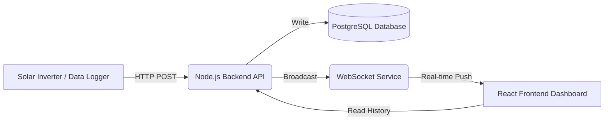

# PowerTrack v2 - Solar Energy Monitoring System

> A comprehensive solar energy monitoring platform designed for educational and government institutions in West Java.

## 1. Project Identity

**Problem Statement**: Managing distributed solar infrastructure across multiple campuses requires a unified, real-time monitoring solution. Manual readings are inefficient, and lack of visibility leads to prolonged downtime and unverified savings.

**High-Level Purpose**: PowerTrack centralizes telemetry from diverse solar installations into a single, interactive dashboard, enabling real-time performance tracking, automated fault detection, and transparent energy accounting.

**Target Audience**:
*   **Schools & Universities**: For campus sustainability dashboards and student education.
*   **Government Agencies**: For regional energy monitoring and policy verification.
*   **Grid Operators**: For distributed generation visibility.

## 2. System Overview

### High-Level Architecture


### Data Flow
1.  **Device**: IoT sensors/loggers collect voltage, current, and power data.
2.  **Backend**: Ingests data via secure API, validates payload, and commits to database.
3.  **Database**: Stores time-series telemetry (partitioned) and organizational metadata.
4.  **WebSocket**: Instantly broadcasts new readings to connected clients.
5.  **Frontend**: Visualizes live data on maps, charts, and leaderboards.

### Major Components
*   **Data Logger**: Standardized ESP32 or industry-standard logger sending JSON payloads.
*   **API Backend**: Node.js/Express server handling ingestion, auth, and business logic.
*   **PostgreSQL Database**: Relational storage for detailed historical analysis.
*   **WebSocket Service**: Low-latency event bus for live updates.
*   **React Dashboard**: Interactive client application for all user roles.

## 3. Tech Stack

*   **Frontend**: React 18, Vite, TailwindCSS, ECharts / Recharts
*   **Backend**: Node.js, Express
*   **Database**: PostgreSQL 14 (managed via Supabase)
*   **Real-time**: Native WebSockets (`ws`)
*   **Hosting**: Docker-ready (Deployable to Vercel/Railway/AWS)

## 4. Features

### A. Public (No Login)
*   **Public Leaderboard**: Rank schools by Specific Yield (kWh/kWp).
*   **Aggregate Stats**: Total energy produced and CO₂ avoided across the region.
*   **Live Network Status**: Real-time map showing active/inactive sites.

### B. School Dashboard
*   **Real-time Monitoring**: Instantaneous Power (kW) and Grid interaction.
*   **Energy Trends**: Daily (kWh), Monthly, and Yearly generation graphs.
*   **Power Flow**: Visualizing Self-consumption vs. Grid Export.
*   **Impact Analysis**: Financial savings and Environmental benefits.
*   **System Health**: Inverter efficiency and connectivity status.

### C. Admin Features
*   **Fleet Management**: View and manage all registered schools.
*   **Provisioning**: "Device Wizard" to onboard new sites and generate keys.
*   **Security**: Manage API keys and user access roles.
*   **Diagnostics**: View raw telemetry and system alerts.

## 5. Telemetry API

**Endpoint**: `POST /api/v1/telemetry/ingest`

**Authentication**:
*   Header: `X-API-KEY: <your-unique-key>`
*   *OR* Basic Auth: Username `device`, Password `<your-unique-key>`

**Sample Payload**:
```json
{
  "power_w": 5400.5,       // Instantaneous AC Power (Watts)
  "voltage": 230.1,        // Grid Voltage (Volts)
  "current_a": 23.4,       // Grid Current (Amps)
  "daily_kwh": 25.5,       // Energy generated today
  "total_kwh": 14500.2,    // Lifetime energy generation
  "load_kw": 2.1,          // (Optional) Site consumption
  "grid_export_kw": 3.3,   // (Optional) Power sent to grid
  "grid_import_kw": 0.0,   // (Optional) Power drawn from grid
  "irradiance_wm2": 850,   // (Optional) Solar irradiance
  "temp_c": 32.5,          // (Optional) Panel temperature
  "ts": 1707384000000      // (Optional) Timestamp in ms
}
```

## 6. Database Design

The schema is optimized for time-series data and relational metadata.

### Core Tables
*   **`schools`**: Organization profile, location, capacity, and settings.
*   **`telemetry`**: High-volume time-series data. **Partitioned by month** to maintain query performance as data grows.
*   **`alerts`**: System notifications for faults or offline events.
*   **`users`**: RBAC user profiles (Admin, School Admin, Viewer).
*   **`system_parameters`**: Global configuration (tariffs, carbon factors).

## 7. Energy Accounting Logic

Key financial and energy metrics are calculated standard formulas:

*   **Self-consumed Energy** = `Generation (kWh)` − `Export to Grid (kWh)`
*   **Financial Savings** = `Self-consumed` × `Electricity Tariff`
*   **Export Value** = `Exported Energy` × `Feed-in Tariff` (if applicable)

**Default Parameters**:
*   **Electricity Tariff**: IDR 1,444.70 / kWh (PLN Residential/Social avg)
*   **Carbon Factor**: 0.85 kg CO₂ / kWh (West Java Grid Mix)

## 8. Environmental Model

Impact is quantified using calibrated conversion factors:

*   **CO₂ Avoided (kg)** = `Total Energy (kWh)` × `Carbon Factor (0.85)`
*   **Trees Planted Eq.** = `CO₂ Avoided` / `21` (Approx. absorption of mature tree/year)
*   **Car Km Avoided** = Derived from average combustion engine emissions.

## 9. Rate Limits & Scaling

*   **Expected Scale**: Designed for 500+ distributed devices.
*   **Throughput**: 1 request per minute per device (standard) up to 1/sec (high-res).
*   **Rate Limiting**: Enforced per **API Key** (not IP) to support NAT/Cellular networks.
    *   Limit: 60 requests / minute / key.

## 10. Deployment Steps

### Backend
1.  **Install**: `cd backend && npm install`
2.  **Config**: Create `.env` (Require: `DATABASE_URL`, `JWT_SECRET`, `WS_PORT`, `FRONTEND_URL`).
3.  **Run**: `npm run db:migrate && npm run dev`

### Frontend
1.  **Install**: `npm install`
2.  **Config**: Create `.env` (Require: `VITE_API_BASE_URL`, `VITE_WS_URL`).
3.  **Run**: `npm run dev` or `npm run build`
4.  **Deploy**: Compatible with Vercel, Netlify, or Static File Serving.

## 11. Environment Variables

| Variable | Description |
| :--- | :--- |
| `DATABASE_URL` | PostgreSQL connection string (Supabase transaction mode recommended) |
| `JWT_SECRET` | Strong secret for signing session tokens |
| `FRONTEND_URL` | CORS allowed origin (e.g., `http://localhost:3000`) |
| `WS_PORT` | Port for WebSocket server (Default: 3002) |
| `API_RATE_LIMIT` | Global rate limit window configuration |

## 12. Hardware Compatibility

PowerTrack is hardware-agnostic, supporting:
*   **Data Loggers**: Standard HTTP-capable loggers (Solarman, Growatt via forwarding).
*   **Custom Hardware**: ESP32/Arduino/Raspberry Pi custom nodes.
*   **Modbus**: RS485-to-HTTP bridges.

## 13. Security

*   **API Authentication**: Strict API Key validation for every telemetry packet. Keys are never passed in URLs.
*   **User Access**: JWT-based authentication with secure, HTTP-only cookie support (optional) or Session Storage.
*   **RBAC**: Strict separation between `System Admin` (Global) and `School Admin` (Local) scopes.

## 14. Limitations

*   **Simulation**: The demo environment uses a PowerShell script to simulate telemetry. Real-world accuracy depends on hardware precision.
*   **Logger Reliability**: Use of cellular modems in rural areas may cause data gaps (handled via timestamp buffering).
*   **Offline Support**: Current version requires active internet connection for dashboard; PWA offline modes are explicitly *not* supported yet.

## 15. Future Roadmap

*   [ ] **Battery Storage**: Dedicated module for monitoring charge/discharge cycles.
*   [ ] **Predictive Analytics**: AI-driven generation forecasting based on weather data.
*   [ ] **Fault Detection**: Automated anomaly detection for string failures.
*   [ ] **Energy Trading**: Multi-campus virtual metering for excess energy accounting.

## 16. Contact

*   **Developer**: Yash Bhardwaj
*   **Email**: byash0712@gmail.com
*   **GitHub**: [https://github.com/YashBhardwaj21/powertrack-v2](https://github.com/YashBhardwaj21/powertrack-v2)

